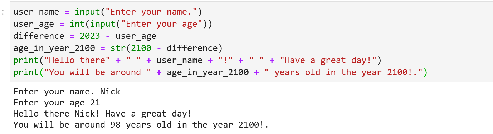

## README

# What does our software do?

Our software prompts the user for first their name and then their age.  Next it calculates how old that the user will be in the year 2100.  Finally, it prints to the screen a greeting containing the user's name and how old they will be in the year 2100.

-----------------------------------------------------------------------------------------------------------------------------------------------------------------------------

# How to use our software

1. The easiest way to access our software is to clone this repository, BigIdeas-Lab-6, directly into JupyterLab and to select "Python 3" as your kernel.  An alternative but more involved option to access this software would be to clone the repository locally assuming that you have the proper Python and JupyterLab extensions installed on your machine to run the code.  Next, to use our software you will need to open the CODE.md file and click into the only code cell inside the file.  Hit Shift + Enter and this should start running the program!

2. After the program has began running, you will be prompted to enter your name.  After you type your name, press Enter.  Next you will be prompted for your age and should handle this the same way as your name!  After you enter your age though something now will be printed to the screen!  A greeting with for you will appear along with how old you will be in the year 2100!

Here is an example of what a successful program run will output:

 

-----------------------------------------------------------------------------------------------------------------------------------------------------------------------------

# How to contribute

All help is extremely appreciated on expanding this project!  We would like to provide a user's age for many other years rather than just 2100.  If you are interested in helping, please feel free to fork the repository!  To do this, navigate to our BigIdeas-Lab-6 repository on GitHub and select the "Fork" option in the top right corner of the page.  The logic behind adding another program that calculates a user's age would be nearly identical besides a little bit of the math changing.  In this case, you should copy the code already provided by us and change it to calculate any year that you believe a user would want to know what their age would be in.  Thank you all!
  